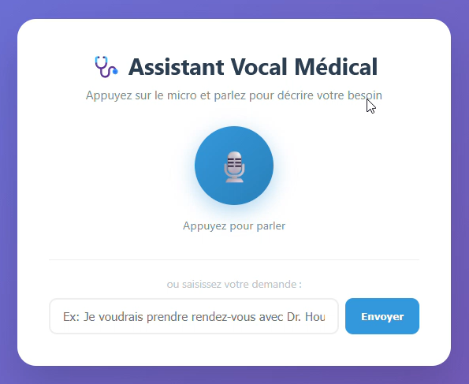
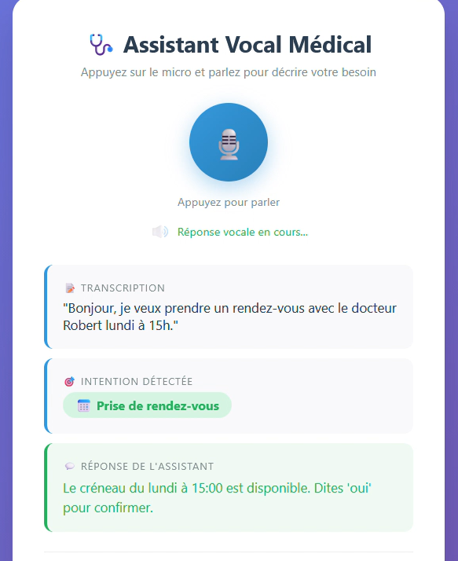
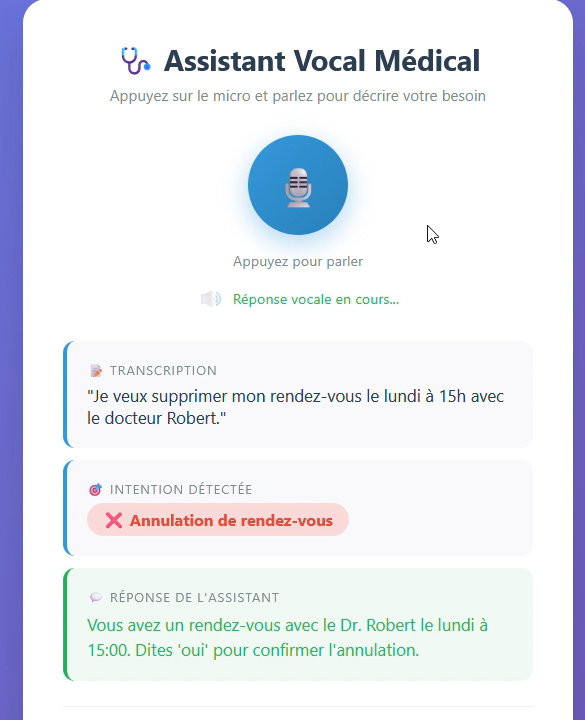
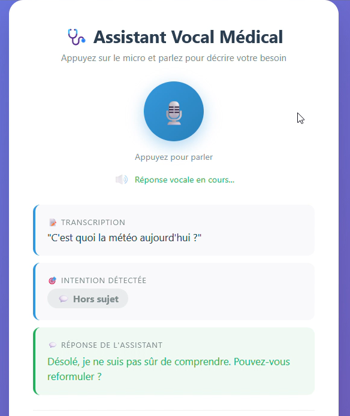
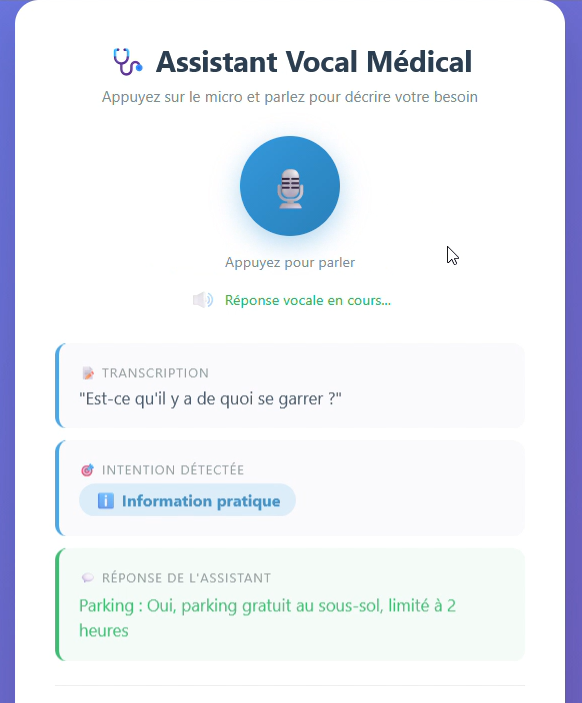
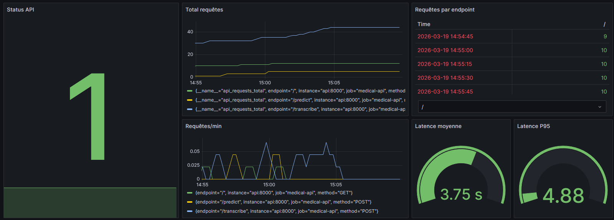
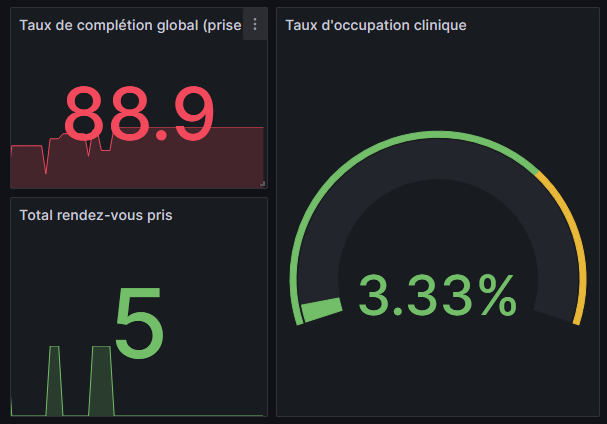
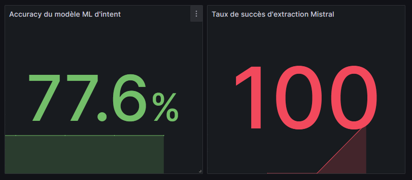

# 🩺 Assistant Vocal Médical



---

## 📖 Description du Projet

Assistant vocal intelligent pour un cabinet médical, permettant aux patients d'interagir par la voix (ou par texte côté panel admin) pour gérer leurs rendez-vous et obtenir des informations pratiques.

**Objectifs principaux :**

- **Prise de rendez-vous vocale** — Le patient dicte sa demande, l'assistant comprend l'intention, extrait les informations. S'il manque des éléments, l'assistant propose les créneaux disponibles et demande à l'utilisateur de préciser les 3 champs obligatoires (médecin, jour, heure).
- **Gestion complète des RDV** — Prise, annulation de rendez-vous via commande vocale avec double confirmation. L'assistant bascule dans un état de confirmation et exige une validation explicite (oui/non) avant de modifier la base de données.
- **Détection d'urgences médicales** — Redirection immédiate vers le SAMU (15) en cas de situation critique détectée.
- **Informations pratiques** — Horaires, adresse, tarifs, parking, liste des médecins disponibles.
- **Réponse vocale (TTS)** — L'assistant répond à la fois par texte (pour du test) et par synthèse vocale.
- **Monitoring & MLOps** — Pipeline automatisé via GitHub Actions (tests, entraînement ML, déploiement). Suivi des performances du modèle ML et des métriques métiers via Prometheus/Grafana, tracking des expérimentations via MLflow.

---

## 📁 Structure du Projet

```
PFE-assistant-vocal-medical/
├── docker-compose.yml              # Orchestration de tous les services
├── .github/workflows/              # Pipeline CI/CD (Tests + ML Training)
├── README.md
│
├── api/                            # API FastAPI (point d'entrée principal)
│   ├── app.py                      # Routes API, middlewares, métriques Prometheus
│   ├── dialogue_manager.py         # Pipeline STT → Intent → Dialogue → TTS
│   ├── Dockerfile
│   ├── requirements.txt
│   └── static/
│       └── index.html              # Interface web (front-end)
│
├── services/
│   ├── dialogue/                   # Logique de dialogue et actions
│   │   ├── router.py               # Routage des intentions vers les handlers
│   │   ├── routes.py               # Handlers : RDV, annulation, urgence, infos
│   │   └── utils.py                # Parsing dates/heures, matching médecins, utilitaires
│   │
│   ├── extraction/                 # Service LLM (Ollama + Mistral)
│   │   ├── ollama_client.py        # Extraction des slots (date, heure, praticien) via LLM
│   │   ├── Dockerfile
│   │   └── start.sh                # Script de démarrage Ollama + pull du modèle Mistral
│   │
│   ├── model_training/             # Entraînement du modèle ML
│   │   ├── train.py                # Script d'entraînement (SVM + TF-IDF) avec MLflow
│   │   ├── prepare_data.py         # Préparation des données (split train/test)
│   │   ├── Dockerfile
│   │   └── requirements.txt
│   │
│   ├── prometheus/
│   │   └── prometheus.yml          # Configuration du scraping Prometheus
│   │
│   └── grafana/
│       ├── dashboards/             # Dashboards JSON pré-configurés
│       │   ├── API monitoring-*.json
│       │   ├── KPI métiers-*.json
│       │   └── Performances IA-*.json
│       └── provisioning/           
│           ├── dashboards/
│           │   └── dashboard.yml
│           └── datasources/
│               └── datasource.yml
│
├── tests/                          # Tests unitaire et de flux complets API
│   ├── integration/               
│   ├── unit/                       
│   ├── ressources/                 # Fichiers audios pour tests
│   └── conftest.py                 # Fixtures et Mocks globaux
|
├── db/
│   └── init/
│       └── schema.sql              # Schéma BDD : médecins, créneaux, RDV, infos cabinet
│
├── data/
│   ├── raw/
│   │   └── data.csv                # Dataset brut (texte + intention)
│   └── processed/
│       ├── train.csv               # Données d'entraînement (80%)
│       └── test.csv                # Données de test (20%)
│
└── mlartifacts/                    # Artefacts des modèles MLflow
    └── 1/models/                   # Modèles enregistrés
```

---

## 🚀 Quick Start

### Prérequis

- Docker & Docker Compose
- (Optionnel) GPU NVIDIA + NVIDIA Container Toolkit pour accélérer Ollama

### Démarrage

```bash
# 1. Cloner le projet
git clone <url-du-repo>
cd PFE-assistant-vocal-medical

# 2. Lancer tous les services
docker compose up --build -d

# 3. Entraîner le modèle ML (première fois obligatoire)
docker compose run --rm train

# 4. (Optionnel) Promouvoir le modèle en Production via MLflow UI
#    → Aller sur http://localhost:5000, sélectionner le modèle, le passer en "Production"
```

### Vérification

```bash
# Vérifier que l'API répond
curl http://localhost:8000/health
# → {"status": "ok"}

# Tester une prédiction d'intention
curl -X POST "http://localhost:8000/predict?text=Je+voudrais+un+rendez-vous+mardi+à+14h+avec+Dr+Robert"

# Vérifier les métriques Prometheus
curl http://localhost:8000/metrics

# Vérifier les créneaux disponibles
curl http://localhost:8000/appointments
```

---

## 🏗️ Architecture du Système

### Architecture Docker

```
┌─────────────────────────────────────────────────────────────────┐
│                        docker-compose                           │
│                                                                 │
│  ┌──────────┐   ┌──────────┐   ┌──────────┐   ┌─────────────┐   │
│  │   API    │   │  MLflow  │   │  Ollama  │   │  PostgreSQL │   │
│  │ FastAPI  | > |  :5000   │   │ (Mistral)│   │    :5432    │   │
│  │  :8000   │   └──────────┘   │  :11434  │   └─────────────┘   │
│  └──────────┘                  └──────────┘                     │
│       │                                                         │
│       ▼                                                         │
│  ┌──────────┐   ┌──────────┐                                    │
│  │Prometheus│ > │ Grafana  │                                    │
│  │  :9090   │   │  :3000   │                                    │
│  └──────────┘   └──────────┘                                    │
│                                                                 │
│  ┌──────────┐ (profil "train", exécution ponctuelle)            │
│  │  Train   │                                                   │
│  │  ML Job  │                                                   │
│  └──────────┘                                                   │
└─────────────────────────────────────────────────────────────────┘
```

| Service        | Image / Build                | Port  | Rôle                                             |
| -------------- | ---------------------------- | ----- | ------------------------------------------------ |
| **api**        | `./api` (FastAPI + Whisper)   | 8000  | API principale, transcription, prédiction, TTS   |
| **db**         | `postgres:15`                | 5432  | Base de données (médecins, créneaux, RDV, infos) |
| **mlflow**     | `ghcr.io/mlflow/mlflow`      | 5000  | Tracking des expérimentations ML                 |
| **ollama**     | `./services/extraction`      | 11434 | LLM Mistral pour extraction de slots             |
| **prometheus** | `prom/prometheus:v2.55.1`    | 9090  | Collecte des métriques                           |
| **grafana**    | `grafana/grafana:11.0.0`     | 3000  | Visualisation des métriques et dashboards        |
| **train**      | `./services/model_training`  | —     | Job d'entraînement ML (profil `train`)           |

### Endpoints API

| Méthode  | Endpoint        | Description                                                    |
| -------- | --------------- | -------------------------------------------------------------- |
| `GET`    | `/`             | Interface web (front-end)                                      |
| `GET`    | `/health`       | Health check de l'API                                          |
| `GET`    | `/appointments` | Liste des créneaux disponibles                                 |
| `GET`    | `/metrics`      | Métriques Prometheus (techniques + métiers)                    |
| `POST`   | `/predict`      | Prédiction d'intention à partir d'un texte (`?text=...`)      |
| `POST`   | `/transcribe`   | Transcription audio + prédiction + action + réponse vocale     |

---

## 🔄 Pipeline du Projet

Le pipeline complet, de la voix du patient à la réponse vocale :

```
  🎤 Patient parle                          🔊 Réponse vocale
       │                                          ▲
       ▼                                          │
┌─────────────┐                           ┌──────────────┐
│  1. Capture │                           │  7. TTS      │
│    Audio    │                           │   (gTTS)     │
│  (WebRTC)   │                           │  Texte → MP3 │
└──────┬──────┘                           └──────────────┘
       │                                          ▲
       ▼                                          │
┌─────────────┐                           ┌──────────────┐
│  2. Whisper │                           │  6. Action   │
│    STT      │                           │   en BDD     │
│  Audio → Txt│                           │  (PostgreSQL)│
└──────┬──────┘                           └──────────────┘
       │                                          ▲
       ▼                                          │
┌─────────────┐    ┌──────────────┐       ┌──────────────┐
│  3. Modèle  │    │  4. Raffine- │       │  5. Dialogue │
│  ML (SVM)   │ -> │  ment par    │   >   │   Router     │
│  Intent     │    │  mots-clés   │       │  + Ollama    │
│  Classifier │    │  (sécurité)  │       │  (extraction)│
└─────────────┘    └──────────────┘       └──────────────┘
```

**Détail des étapes :**

1. **Capture Audio** — L'utilisateur enregistre sa voix via le navigateur (WebRTC/MediaRecorder). Le fichier audio est envoyé au endpoint `/transcribe`.

2. **Transcription (Whisper)** — Le modèle Whisper (OpenAI) transcrit l'audio en texte français.

3. **Classification d'intention (Modèle ML)** — Le texte transcrit est envoyé au modèle SVM entraîné via MLflow. Il prédit l'intention parmi : `book_appointment`, `cancel_appointment`, `medical_urgency`, `info_practical`, `off_topic`.

4. **Raffinement par mots-clés** — Un filet de sécurité corrige l'intention du modèle ML en détectant des mots-clés forts (ex: "annuler" → `cancel_appointment`, "urgence" → `medical_urgency`). Protège aussi contre les erreurs de transcription de Whisper.

5. **Dialogue Router + Extraction LLM (Ollama/Mistral)** — Selon l'intention, le router délègue aux handlers appropriés. Pour les RDV, Ollama (Mistral) extrait les slots (date, heure, praticien) du texte via `instructor` (JSON structuré). S'il manque des champs pour un RDV, l'assistant consulte la base de données, liste les possibilités réelles et exig les 3 champs (médecin, jour, heure). Une fois toutes les infos réunies, demande de double confirmation explicite

6. **Action en BDD** — Le handler exécute l'action correspondante en base de données PostgreSQL (réservation, annulation, consultation d'infos pratiques, etc.) une fois la confirmation obtenue.

7. **TTS (gTTS)** — La réponse textuelle est convertie en audio MP3 via Google Text-to-Speech et renvoyée en base64 au client, qui la joue automatiquement.

**Mode texte** : Le même pipeline est utilisé via `/predict`, en sautant l'étape 1 (capture) et 2 (transcription).

---

## 🖼️ Tableau des scénarios

| Scénario                        | Image                                      |
|----------------------------------|---------------------------------------------|
| Accueil                 |             | 
| Prise de rendez-vous             |                 | 
| Annulation de rendez-vous             |                 | 
| Question hors sujet              |            | 
| Information pratique (parking)   |                  |

---

## 🛡️ Évaluation ML & Guarde-fous (IA)

- **Dataset** — Le dataset contient des phrases en français réparties en 5 intentions (`book_appointment`, `cancel_appointment`, `medical_urgency`, `info_practical`, `off_topic`), split 80/20 train/test.
- **Validation du modèle** — L'accuracy est calculée sur le jeu de test à chaque entraînement et loggée dans MLflow.
- **Seuil de confiance** — Un seuil de confiance (`0.4`) est appliqué : si le modèle n'est pas assez sûr, l'intention est reclassifiée en `off_topic`.
- **Filet de sécurité mots-clés** — Correction post-prédiction par mots-clés pour les cas critiques (urgences, annulations).
- **Vérifications LLM** — Après extraction par Ollama, les slots sont validés (le jour extrait doit exister dans le texte original, idem pour l'heure) pour éviter les hallucinations.

---

## 🤖 Modèle ML

### Caractéristiques du modèle

| Propriété               | Valeur                                                      |
| ------------------------ | ----------------------------------------------------------- |
| **Type**                 | SVM (Support Vector Machine) avec noyau linéaire            |
| **Vectorisation**        | TF-IDF (unigrammes + bigrammes, `max_df=0.95`, `min_df=1`) |
| **Pipeline**             | `TfidfVectorizer` → `SVC(probability=True, kernel="linear")`|
| **Classes prédites**     | `book_appointment`, `cancel_appointment`, `medical_urgency`, `info_practical`, `off_topic` |
| **Framework**            | scikit-learn                                                |
| **Tracking**             | MLflow (Model Registry)                                     |
| **Seuil de confiance**   | 0.4 (en dessous → `off_topic`)                              |

### Features utilisées

- **Texte brut** — Les phrases des patients sont vectorisées via TF-IDF.
- **N-grams** — Unigrammes et bigrammes (`ngram_range=(1, 2)`) pour capturer les expressions multi-mots (ex: "rendez-vous", "prendre rdv").
- **Probabilités** — `probability=True` permet d'obtenir un score de confiance pour chaque prédiction.

### Entraîner et tracker le modèle

```bash
# 1. Préparer les données (split train/test depuis data/raw/data.csv)
docker compose run --rm train python services/model_training/prepare_data.py

# 2. Entraîner le modèle (loggé automatiquement dans MLflow)
docker compose run --rm train

# 3. Consulter les résultats dans MLflow UI
#    → http://localhost:5000
#    → Experiment : "medical_intent_classification"

# 4. Promouvoir le modèle en Production
#    → Dans MLflow UI : sélectionner le run → Register Model → "medical_intent_classifier"
#    → Transition vers le stage "Production"
```

Le modèle est chargé automatiquement par l'API depuis le Model Registry MLflow :
```
models:/medical_intent_classifier/Production
```

---

## 🛠️ Technologies Utilisées

| Catégorie            | Technologies                                                               |
| -------------------- | -------------------------------------------------------------------------- |
| **Backend**          | Python, FastAPI, Uvicorn, PostgreSQL                                       |
| **NLP & Speech**     | OpenAI Whisper (STT), gTTS (TTS), Ollama + Mistral (extraction LLM)       |
| **Machine Learning** | scikit-learn (SVM, TF-IDF), MLflow (tracking, Model Registry)              |
| **Data Validation**  | Pydantic, Instructor (structured LLM output)                              |
| **MLOps**            | MLflow, Docker, Prometheus, Grafana                                        |
| **Frontend**         | HTML/CSS/JS vanilla (WebRTC pour la capture audio)                         |
| **Base de données**  | PostgreSQL 15                                                              |
| **Containerisation** | Docker, Docker Compose                                                     |
| **Monitoring**       | Prometheus (métriques), Grafana (dashboards)                               |

---

## 📊 Performance

**Métriques suivies :**

- **Modèle ML** — Accuracy et F1-Score (trackés dans MLflow et exposés via Prometheus)
- **API** — Latence des requêtes, nombre total de requêtes (par endpoint et méthode)
- **Métiers** — Nombre de rendez-vous réservés, taux d'occupation des créneaux
- **LLM** — Taux de succès des extractions de slots via Ollama

**Dashboards Grafana disponibles :**
- API Monitoring (latence, requêtes, erreurs)

- KPI Métiers (RDV réservés, taux d'occupation)

- Performances IA (accuracy, F1, extractions)


---

## 🧪 Tests Automatisés (CI/CD)

La robustesse du code est assurée par une suite de tests automatisés utilisant pytest :
- Tests unitaires (tests/unit/) : valident la logique interne des fonctions de manière isolée (ex: routage du dialogue, formatage des heures, matching des médecins).
- Tests d'intégration (tests/integration/) : Lancent l'API et la base de données dans des conteneurs pour simuler des requêtes HTTP réelles.
- Pour garantir des tests rapides et éviter les surcharges processeur (surtout sur GitHub Actions), les appels au LLM Mistral (Ollama) n'ont pas été automatisés.

```bash
# Pour lancer les tests localement :
pytest tests/
```


## 🔗 URLs Clés (Mode Docker)

| Service                | URL                                          |
| ---------------------- | -------------------------------------------- |
| **Interface Web**      | http://localhost:8000                         |
| **API — Swagger UI**   | http://localhost:8000/docs                    |
| **API — ReDoc**        | http://localhost:8000/redoc                   |
| **API — Health Check** | http://localhost:8000/health                  |
| **API — Métriques**    | http://localhost:8000/metrics                 |
| **MLflow UI**          | http://localhost:5000                         |
| **Grafana**            | http://localhost:3000 (admin / admin)         |
| **Prometheus**         | http://localhost:9090                         |

## 🎥 Démonstration vidéo

https://www.youtube.com/watch?v=FOBUrpv_wQc

_Valentine Dumange / Kilian Davoust_
